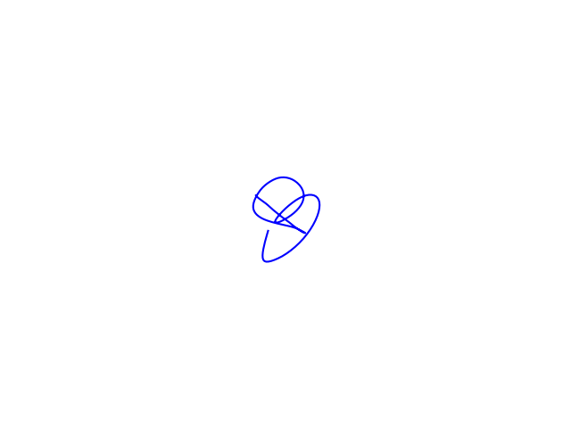

# smart-pen

## 최종 결과물

- 작품 사진

  

- 작품 시연 결과물

  별모양 | 알파벳 W | 알파벳 B
  ---|---|---
  ||

- [시연 영상, Youtube](https://youtu.be/AMKU_AyEsPM)

## 최종 소스코드 및 README
[`src` 폴더](src) 아래에 있는 소스코드가 해당 소스코드입니다.
- `nano33ble_v2`: 아두이노에 이식하는 소스코드
- `pc_app`: PC에서 실행시키는 소스코드,	해당 폴더에 있는 [`README`파일](src/pc_app/readme.md)을 읽어주세요
## 프로젝트 일정

주차|내용|비고
---|---|---
1|각각 조사(IMU, 필터)-> 경로 계산하는 방법 조사한 내용 발표, 보완 -> 최종 방안 역할 분담|
2|**IMU-MCU 연결 + 데이터 받는 데모**(in 아두이노 나노) filter 논문분석 환경구축(~~PC (i3 4150 + 8GB + WD 320GB)~~, 기존 서버PC에 ubuntu로 구성)|펜 단에서 구현
3|아두이노 블루투스 (딜레이가 클 것 -> esp32 / Arduino Nano 33 BLE 고려)  자기센서도 사용 계획 논문분석(필터위주 - 칼만, 상보, 매드윅) 데이터 실시간 처리로 수정 eval kit (실험) 팀뷰어 환경 구성 구매목록: abx00034(3개), mpu9250(3개), bno055(2개)|펜 단에서 구현
4|블루투스로 데이터 전송 목표 1. 센서 : 자은 (태웅 찬욱 지민) 2. 나노ble : 태웅 (자은 찬욱 지민) 3. 메인코드 자기센서 : 지민 창민 4. GUI : 종찬 창민 5. 논문 필터예제 : 지민 창민|
5|1. BNO055 Bluetooth 전송 : 자은, 태웅, 지민 2. ABX(NANO BLE) Bluetooth 전송 : 자은, 태웅, 지민 3. matlab코드 filter 수정(Mahony -> Madgwick) : 종찬 4. ABX(NANO BLE)에 Madgwick 구현 : 창민|pc 단에서 구현
6|1. 프로젝션 3d -> 2d 처음 중간 끝 점 노멀 벡터 크로스 프로덕트 -> 지민 (둘 다) 2. 샘플레이트 (타이머 인터럽트) 아두이노 샘플레이트 제한 -> 지민 3. bno + avr 나노 + 시리얼 블투 -----> 블투 시리얼 + pc -> 지민 4. 포스터 -> 창민, 종찬 5. 실시간 매트랩 vs 파이썬(원형큐, 스레드) -> 창민(완전이식(2주)), 종찬(파이썬ble), 태웅, 자은 ~~5.1 필터 게인~~ ~~매트랩 vs 파이썬 -> 필터 값 찾기~~|pc 단에서 구현
7|최종 연산 1. 정확도 문제 - Magwick 필터 적용 2. 실시간 처리 문제 - ploting 3. view point 문제|
8|보고서 작성, 시연 영상 : 폰-웹 앱|
9|---------------------|
10 (~9/30)|마무리|최종 결과물
