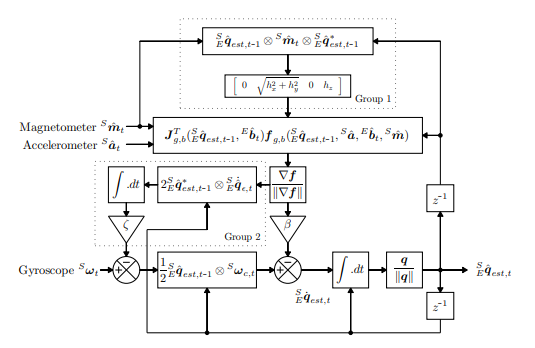

Madgwick 필터
===

# 목적

**MARG 센서(Hybrid IMU:각속도,가속도 외 자기센서) 축 추정을 위한 데이터 융합 알고리즘**

MARG(Magnetic, Angular Rate, and Gravity) ~= AHRS(Attitude and Heading Reference System)

MEMS 각속도계(자이로스코프)만으로는 계산된 방향에 대한 오차가 계속 누적되는 오류 존재 => 절대 방향 측정 제공 불가

가속도계와 자력계로 지구의 중력장과 자기장을 추가적으로 축을 두어 절대 좌표 보정이 필요

> IMU 축(각속도+가속도)에 해당하는 데이터만으로는 불충분 + 원시 데이터에도 편향 존재(각속도계:드리프트 현상, 자기계:자기 왜곡 현상;근처의 강자성 요소(전자기기, 금속물체, 건물내 프레임)의 영향이 나타남)

IMU의 모든 데이터를 융합하여 다른 유형의 데이터에서 방생하는 오류를 줄이는 것 => 추정 정확도 향상을 목표

# 알고리즘

전체 Block Diagram
- 지구 프레임에 해당하는 좌표 시스템이 2개(가속도계, 자기계)
- 경사하강법

- Group 1에서 자기 왜곡 현상 보상
- Group 2에서 드리프트 보상

kalman 필터 -> 선형 회귀,
추가적으로 Mahony 보완 필터 -> IMU에서만 검증

Madgwick 필터 -> gradient descent -> 온라인 자기 왜곡 보상

기타 융합 알고리즘으로 [`Mahony filter`](https://ieeexplore.ieee.org/document/4608934), [`Extended Kalman filter`](https://en.wikipedia.org/wiki/Extended_Kalman_filter)도 존재

# 필터 코드/라이브러리

- `./code` 폴더 아래에 각 언어별로 폴더로 두었습니다
- python의 경우: https://ahrs.readthedocs.io/en/latest/filters/madgwick.html 에서 reference 참고
- 아두이노에 내장
  - https://www.youtube.com/watch?v=_p90b5IHAlI
  - https://gist.github.com/shfitz/a8704a890497cd43789a3bc029179245
  - https://itp.nyu.edu/physcomp/lessons/accelerometers-gyros-and-imus-the-basics/

# 관련 시연 & 프로젝트

- [Youtube, Open Source IMU and AHRS Algorithm with x-IMU, 110928](https://www.youtube.com/watch?v=BXsGWoOMtmU)
- [Youtube, AHRS(MARG)- MPU 9250 with Madgwick Filter, 220415](https://www.youtube.com/watch?v=Iqebe_VUAmk)
- [Youtube, IMU MPU-9250 + Arduino + AHRS (Madgwick’s algorithm), 180619](https://www.youtube.com/watch?v=JzMaCKzWyiY)
- [GitHub, DonovanZhu, 9DoF_MARG_Madgwick_Filter](https://github.com/DonovanZhu/9DoF_MARG_Madgwick_Filter)
- [Youtube, Sensor Fusion on Android Devices: A Revolution in Motion Processing, 100809](https://www.youtube.com/watch?v=C7JQ7Rpwn2k)

# Reference

- https://code.google.com/archive/p/imumargalgorithm30042010sohm/
- https://x-io.co.uk/open-source-imu-and-ahrs-algorithms/
- https://x-io.co.uk/downloads/madgwick_internal_report.pdf
- https://x-io.co.uk/downloads/madgwick_algorithm_matlab.zip
- https://x-io.co.uk/downloads/madgwick_algorithm_c.zip